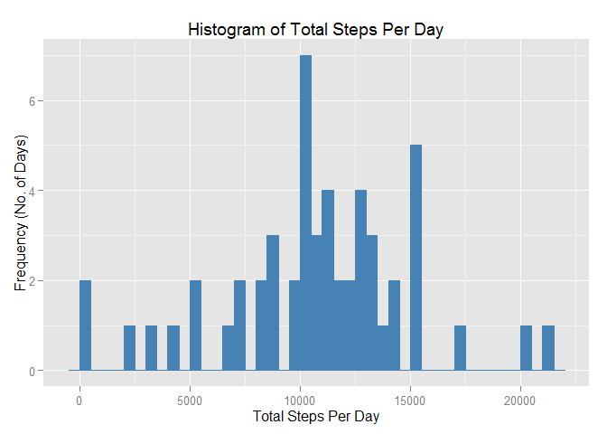
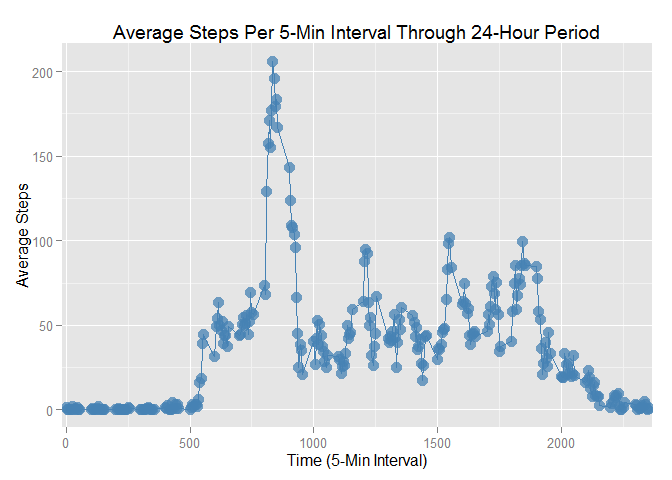
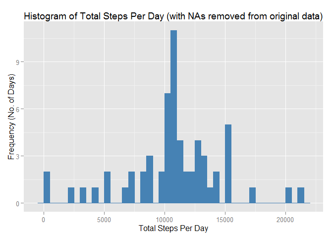
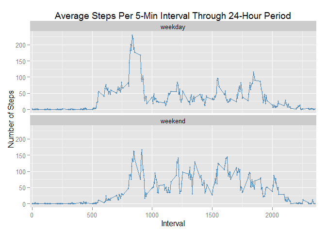

# Reproducible Research: Peer Assessment 1


## Loading and preprocessing the data


```r
## The following libraries are required for my assignment answers:
library(knitr)
library(dplyr)
```

```
## 
## Attaching package: 'dplyr'
## 
## The following object is masked from 'package:stats':
## 
##     filter
## 
## The following objects are masked from 'package:base':
## 
##     intersect, setdiff, setequal, union
```

```r
library(ggplot2)
library(reshape2)

##The data was supplied in a zip file, so first we will unzip it:
unzip("activity.zip")

##Next, we read the csv file into a data frame:
act <- read.csv("activity.csv")
```

## What is mean total number of steps taken per day?

1. Calculate the total number of steps taken per day

```r
#Calculate total steps per day (SPD)
spd<- act %>% group_by(date) %>% summarise(sum_steps=sum(steps))
```

2. Make a histogram of the total number of steps taken each day


```r
g<-ggplot(spd, aes(sum_steps))
p<-g+geom_histogram(color="steelblue", fill="steelblue", binwidth=500)+
        
        ##Add a title and labels for the axes
        labs(title="Histogram of Total Steps Per Day")+
        labs(x="Total Steps Per Day")+
        labs(y="Frequency (No. of Days)")
        
        #Print the graph on the screen
        print(p)
```

 

3. Calculate and report the mean and median of the total number of steps taken per day


```r
mean(spd$sum_steps, na.rm=TRUE)
```

```
## [1] 10766.19
```

```r
median(spd$sum_steps, na.rm=TRUE)
```

```
## [1] 10765
```


## What is the average daily activity pattern?

1. Make a time series plot (i.e. type = "l") of the 5-minute interval (x-axis) and the average number of steps taken, averaged across all days (y-axis)


```r
#Calculate average steps per interval (SPI)
spi<-act %>% group_by(interval) %>% summarize(mean_steps=mean(steps, na.rm=TRUE))

#Create a time series plot
g<-ggplot(spi, aes(interval,mean_steps))
p<-g+geom_point(color="steelblue", size=4, alpha=3/4)+
        coord_cartesian(xlim = c(-15, 2370))+
        geom_line(color="steelblue")+
        labs(title="Average Steps Per 5-Min Interval Through 24-Hour Period")+
        labs(x="Time (5-Min Interval)")+
        labs(y="Average Steps")

        print(p)
```

 


2. Which 5-minute interval, on average across all the days in the dataset, contains the maximum number of steps?

The 5-minute interval with, on average across all the days in the dataset, the maximumn number of steps, is 835:

```r
#Subset the data to find which interval has the maximum number of steps, and what the maximum number of steps is:
spi[which.max(spi$mean_steps),]
```

```
## Source: local data frame [1 x 2]
## 
##   interval mean_steps
## 1      835   206.1698
```


## Imputing missing values

1. Calculate and report the total number of missing values in the dataset (i.e. the total number of rows with NAs)


```r
#Subset the original data frame to return only rows where the steps value is NA
NA_rows<-subset(act,is.na(act$steps))

#Count the number of rows in the subsetted dataframe to find the number of NAs
nrow(NA_rows)
```

```
## [1] 2304
```


2. Devise a strategy for filling in all of the missing values in the dataset. The strategy does not need to be sophisticated. For example, you could use the mean/median for that day, or the mean for that 5-minute interval, etc.


```r
#The mean for the 5 minute interval will be used to fill the missing values in the dataset. We have a dataframe with the average steps per interval from an earlier question:
spi<-act %>% group_by(interval) %>% summarize(mean_steps=mean(steps, na.rm=TRUE))
```


3. Create a new dataset that is equal to the original dataset but with the missing data filled in.


```r
#Join the dataframe with average steps by interval, onto the activity dataframe, so that there is a new column with the average steps for each interval
act_wo_na <- inner_join(act,spi,by="interval")

#For every row with steps=NA, replace the NA with the average steps for that interval
for (i in 1:nrow(act_wo_na)){
        if (is.na(act_wo_na$steps[i])) {
                act_wo_na$steps[i]<-act_wo_na$mean_steps[i]
        }
}

#Remove the column with average steps per interval
act_wo_na<- select(act_wo_na,-mean_steps)
```


4. Make a histogram of the total number of steps taken each day and Calculate and report the mean and median total number of steps taken per day. Do these values differ from the estimates from the first part of the assignment? What is the impact of imputing missing data on the estimates of the total daily number of steps?


```r
#Calculate total steps per day (SPD) with non-NA dataframe
spd_wo_na<- act_wo_na %>% group_by(date) %>% summarise(sum_steps=sum(steps))

g<-ggplot(spd_wo_na, aes(sum_steps))
p<-g+geom_histogram(color="steelblue", fill="steelblue", binwidth=500)+
        
        ##Add a title and labels for the axes
        labs(title="Histogram of Total Steps Per Day (with NAs removed from original data)")+
        labs(x="Total Steps Per Day")+
        labs(y="Frequency (No. of Days)")
        
        #Print the graph on the screen
        print(p)
```

 

```r
mean(spd_wo_na$sum_steps, na.rm=TRUE)
```

```
## [1] 10766.19
```

```r
median(spd_wo_na$sum_steps, na.rm=TRUE)
```

```
## [1] 10766.19
```

The mean and median do not differ materially from the estimates found in the first part of the assignment. However, inputting the missing data has the impact of increasing the total daily number of steps.

## Are there differences in activity patterns between weekdays and weekends?

For this part the weekdays() function may be of some help here. Use the dataset with the filled-in missing values for this part.

1. Create a new factor variable in the dataset with two levels - "weekday" and "weekend" indicating whether a given date is a weekday or weekend day.


```r
#Use a loop to add a column specifying whether the measurement was taking on a weekday or weekend.
for (i in 1:nrow(act_wo_na)){
        if (weekdays(as.Date(act_wo_na$date[i]))=="Saturday"|weekdays(as.Date(act_wo_na$date[i]))=="Sunday") {
                act_wo_na$day[i]<-"weekend"
        }
        else {
                act_wo_na$day[i]<-"weekday"
        }
}

#Convert the new column to the factor class.
act_wo_na$day<-factor(act_wo_na$day)
```


2. Make a panel plot containing a time series plot (i.e. type = "l") of the 5-minute interval (x-axis) and the average number of steps taken, averaged across all weekday days or weekend days (y-axis). See the README file in the GitHub repository to see an example of what this plot should look like using simulated data.


```r
#Using package "reshape2", melt and cast the data to summarize the data by both interval and weekday/weekend.
spi_days_melt <- melt(act_wo_na,id.vars=c("date","interval","day"))
spi_days_cast<-dcast(spi_days_melt,interval+day~variable,mean)

#Create a time series plot.
g<-ggplot(spi_days_cast, aes(interval,steps))
p<-g+geom_point(color="steelblue", size=1, alpha=3/4)+
        geom_line(color="steelblue")+
        coord_cartesian(xlim = c(-15, 2370))+
        facet_wrap(~day,nrow=2)+
        labs(title="Average Steps Per 5-Min Interval Through 24-Hour Period")+
        labs(x="Interval")+
        labs(y="Number of Steps")

        print(p)
```

 

